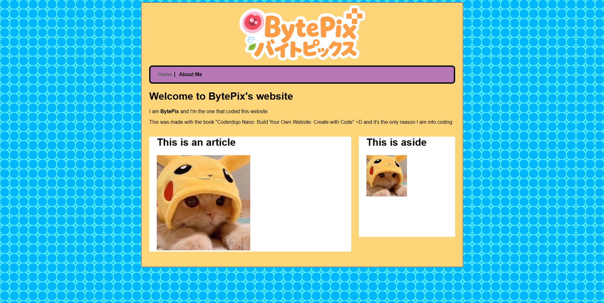

# Welcome to my website!
Thank you for visiting my website. It is currently a work-in-progress and the style will most definitely change in the future.

# FAQ (5 May 2025)
## What is this for?
I am thinking about making this my portfolio/resume website, showcasing all my skills and projects I made. Currently this is still my first "real" project made by hand (aka, minimal to no AI usage).
## Did you make this website design yourself?
No, I didn't. This style is made with help from the book 'Create With Code: Build Your Own Website' from CoderDojo. If you have read the book, you may have noticed this style is nearly 1:1 (at it's current stage).
## Did you make the logo yourself?
Unfortunately not, I'm not a very creative or artistic person. This logo was made by ChatGPT, with references from the #library channel in HackClub's Slack. 